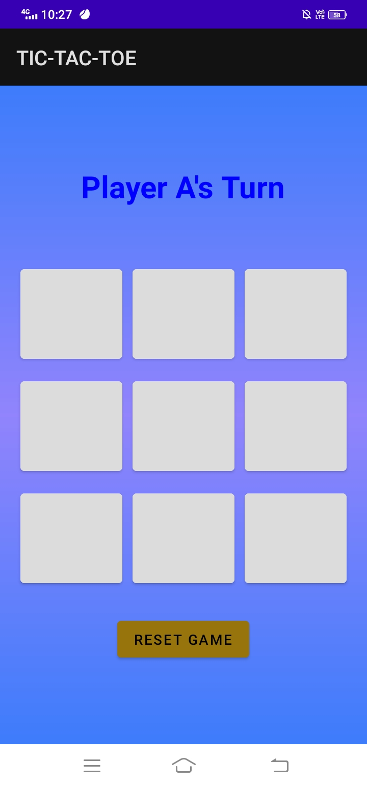
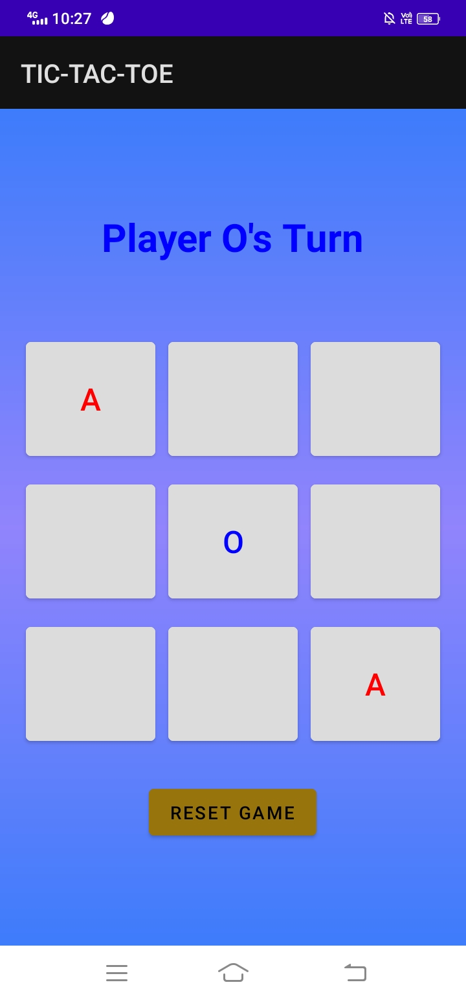
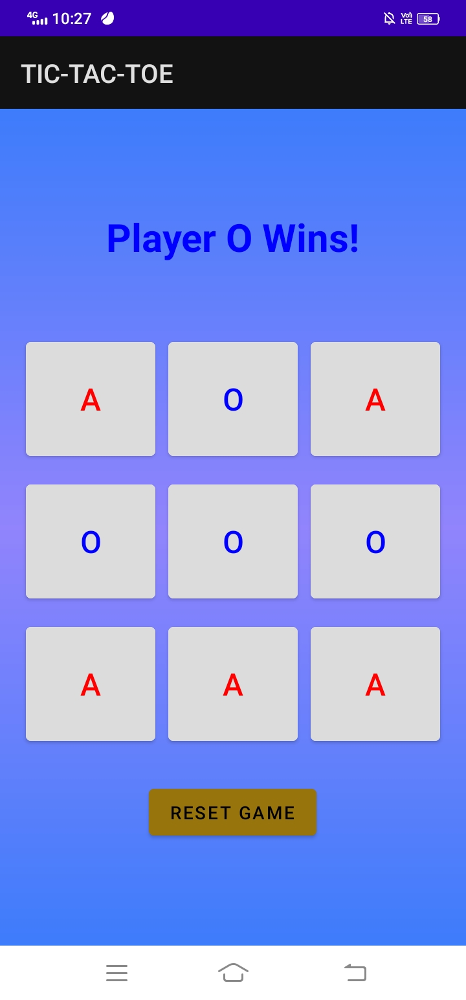

**TASK-04**

# Tic Tac Toe Application

A classic Tic Tac Toe game developed using Android Studio and Java. This application allows two players to play the game on the same device.

## Features

- **Two-Player Game**: Play Tic Tac Toe with a friend on the same device.
- **Simple Interface**: Clean and intuitive user interface.
- **Restart Game**: Easily restart the game after it ends.

## Screenshots





## Getting Started

### Prerequisites

- Android Studio 3.0 or higher
- Java JDK 8 or higher
- Android device or emulator running Android 5.0 (Lollipop) or higher

### Installation

1. **Clone the Repository**:
   ```bash
   https://github.com/Keerthana27cse/Prasunet_AD_04.git
   
**#Prasunet**
